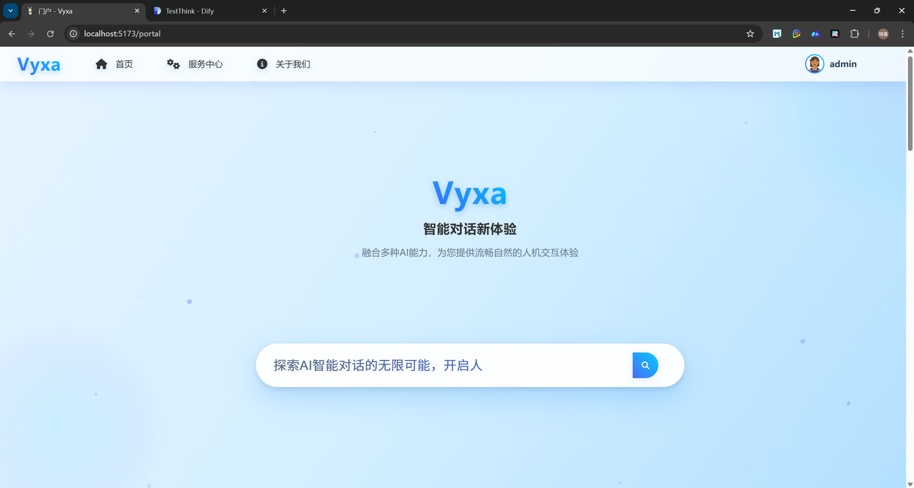
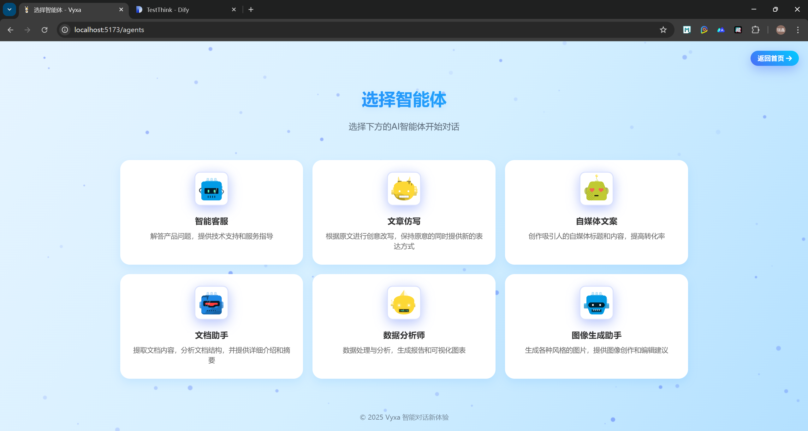
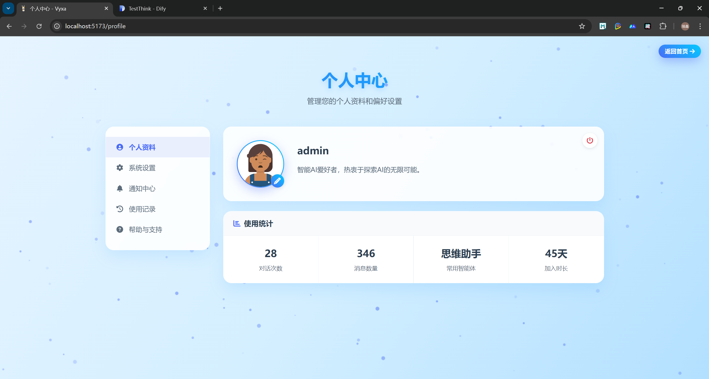
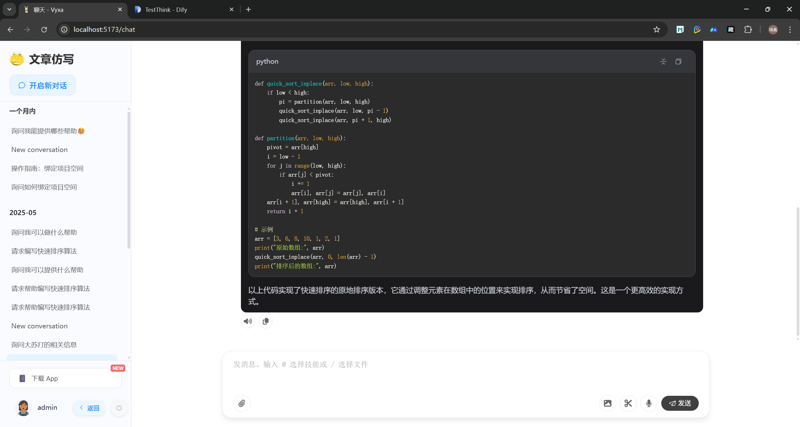

# Vyxa - 智能对话平台

基于Vue 3和Dify API开发的智能聊天应用，提供流畅的AI对话体验和多智能体选择功能。

[//]: # (<div align="center">)

[//]: # (  )

[//]: # (  <p>下一代智能对话新体验</p>)

[//]: # (</div>)

## 🌟 功能特性

- 🤖 **多智能体选择**：支持不同领域的AI智能体对话，满足多样化场景需求
- 💬 **流式响应**：实时流式对话，体验流畅自然，减少等待时间
- 🖼️ **优化的头像加载**：自动处理头像加载失败和加载中状态，提升用户体验
- 🔒 **用户认证**：简洁的用户登录/登出系统，保障账户安全
- 📱 **响应式设计**：完美适配移动端和桌面端，随时随地开启对话
- 🌐 **国际化支持**：多语言界面切换，满足全球用户需求
- 📤 **文件交互**：支持与AI对话时上传文件，增强信息交流
- 🔊 **语音交互**：便捷的语音输入和输出，解放双手
- 📊 **图表渲染**：支持ECHarts图表展示，直观呈现数据
- 🎨 **主题切换**：支持浅色/深色主题，呵护用户视觉体验

## 📸 项目截图

<div align="center">
  
  <p>首页</p>

  
  <p>智能体选择页面</p>

 
  <p>个人中心</p>

  
  <p>聊天界面</p>

</div>

## 🛠️ 技术栈

- **前端框架**：[Vue 3](https://vuejs.org/) + [TypeScript](https://www.typescriptlang.org/) + [Vite](https://vitejs.dev/)
- **状态管理**：[Pinia](https://pinia.vuejs.org/) (带持久化)
- **UI组件库**：[Element Plus](https://element-plus.org/)、[MateChai](https://matechat.gitcode.com/)
- **图表库**：[ECharts](https://echarts.apache.org/)
- **样式处理**：[SCSS](https://sass-lang.com/)
- **API集成**：
    - [Axios](https://axios-http.com/)：基于Promise的HTTP客户端（用于普通REST请求）
    - [Fetch API](https://developer.mozilla.org/en-US/docs/Web/API/Fetch_API)：原生流处理（用于流式聊天响应）
- **工具封装**：自定义HTTP工具（axiosHttpUtils和fetchHttpUtils）
- **流式响应**：[Server-Sent Events (SSE)](https://developer.mozilla.org/en-US/docs/Web/API/Server-sent_events) 实时数据流

## 🚀 快速开始

### 环境要求

- Node.js 20.x 或更高版本
- NPM 9.x 或更高版本

### 安装步骤

1. 克隆仓库
```bash
git clone https://github.com/yourusername/chat-ai-dify.git
cd chat-ai-dify
```

2. 安装依赖
```bash
npm install
```

3. 配置环境变量，创建`.env.local`文件
```
VITE_API_BASE_URL=您的Dify API地址
VITE_DEMO_USERNAME=admin
VITE_DEMO_PASSWORD=123456
VITE_APP_TITLE=Vyxa
```

4. 启动开发服务器
```bash
npm run dev
```

5. 在浏览器中访问
```
http://localhost:5173
```

### 构建部署

```bash
# 构建生产版本
npm run build

# 预览构建结果
npm run preview
```

## 📂 项目结构

```
src/
├── api/                       # API接口封装
│   ├── dify/                  # Dify API接口
│   │   ├── app.ts             # 应用相关接口
│   │   ├── chat.ts            # 聊天功能接口
│   │   ├── constants.ts       # 常量定义
│   │   ├── core.ts            # 核心请求方法
│   │   ├── files.ts           # 文件处理接口
│   │   ├── index.ts           # 统一导出
│   │   ├── speech.ts          # 语音相关接口
│   │   └── types.ts           # 类型定义
│   ├── user/                  # 用户相关接口
│   └── index.ts               # API统一导出
├── assets/                    # 静态资源
├── components/                # 可复用组件
│   ├── AvatarImage.vue        # 通用头像组件
│   ├── BackHomeButton.vue     # 返回首页按钮
│   ├── EchartsRenderer.vue    # 图表渲染组件
│   ├── ErrorPage.vue          # 错误页面组件
│   ├── IntroPanel.vue         # 智能体介绍面板
│   ├── LoadingAnimation.vue   # 加载动画组件
│   ├── MediaRenderer.vue      # 媒体文件渲染组件
│   └── ParticleBackground.vue # 粒子背景效果
├── mock/                      # 模拟数据
├── router/                    # 路由配置
├── stores/                    # Pinia状态管理
│   ├── agent.ts               # 智能体状态
│   ├── theme.ts               # 主题状态
│   └── user.ts                # 用户状态
├── styles/                    # 全局样式
├── types/                     # TS类型定义
├── utils/                     # 工具函数
│   ├── axiosHttpUtils.ts      # 基于Axios的HTTP请求工具
│   ├── fetchHttpUtils.ts      # 基于Fetch API的HTTP请求工具
│   └── debounce.ts            # 防抖函数
├── views/                     # 页面视图组件
│   ├── agent/                 # 智能体相关页面
│   │   ├── AgentSelect.vue    # 智能体选择页面
│   │   ├── BingChat.vue       # Bing风格聊天界面
│   │   ├── ChatSidebar.vue    # 聊天侧边栏组件
│   │   └── DifyMateChat.vue   # Dify聊天界面
│   ├── error/                 # 错误页面
│   │   ├── 403.vue            # 无权限页面
│   │   ├── 404.vue            # 页面未找到
│   │   └── 500.vue            # 服务器错误
│   ├── home/                  # 首页相关
│   │   ├── Index.vue          # 首页
│   │   └── Login.vue          # 登录页面
│   ├── portal/                # 门户页面
│   │   └── Index.vue          # 门户首页
│   └── user/                  # 用户相关页面
│       ├── Profile.vue        # 用户资料页
│       ├── UserAvatar.vue     # 用户头像组件
│       └── UserProfile.vue    # 用户资料编辑
├── App.vue                    # 根组件
├── main.ts                    # 入口文件
└── style.css                  # 全局样式
```

## 🧩 组件说明

### AvatarImage 通用头像组件

专为高性能网络体验设计的头像组件：
- 自动处理加载状态，显示加载动画
- 优雅处理图片加载失败，显示替代图标
- 支持自定义大小、形状和边框样式
- 适配各种场景下的头像展示需求

使用示例：
```vue
<AvatarImage 
  :src="avatar" 
  :alt="username" 
  :size="40"
  :border="true"
  shape="circle"
  custom-class="custom-avatar"
/>
```

### LoadingAnimation 加载动画组件

美观、轻量的加载状态指示器：
- 支持多种动画样式（波浪、旋转、脉冲等）
- 可自定义颜色和大小
- 支持文字提示
- 适用于各种加载场景

使用示例：
```vue
<LoadingAnimation 
  type="wave" 
  :size="48" 
  color="#3498db" 
  text="正在加载中..." 
/>
```

### EchartsRenderer 图表渲染组件

基于ECharts的可视化图表组件：
- 支持多种图表类型（折线图、柱状图、饼图等）
- 自适应容器大小
- 主题定制
- 事件监听
- 自动从Markdown代码块提取图表配置

使用示例：
```vue
<EchartsRenderer 
  :options="chartOptions" 
  :theme="darkMode ? 'dark' : 'light'"
  height="300px" 
  @chart-click="handleChartClick" 
/>
```

### MediaRenderer 媒体文件渲染组件

专门用于渲染各类媒体文件：
- 支持图片、视频等多媒体展示
- 图片预览和缩放功能
- 优雅处理加载状态和失败状态
- 与Markdown内容无缝集成

使用示例：
```vue
<MediaRenderer
  :mediaFiles="mediaFiles"
  :content="markdownContent"
  @imageClick="handleImagePreview"
  @imageLoaded="handleImageLoaded"
/>
```

### 聊天系统组件

#### ChatSidebar 聊天侧边栏组件
- 对话历史管理与搜索
- 会话创建、切换和删除
- 会话重命名功能
- 响应式布局设计

#### DifyMateChat / BingChat 聊天界面
- 流式响应实时渲染
- 多种消息类型支持（文本、图片、图表等）
- 代码高亮显示（支持多种编程语言）
- 消息复制与语音朗读
- 建议问题快捷选择

### 粒子背景组件

创建动态视觉效果的交互式背景：
- 可自定义粒子数量和颜色
- 响应鼠标移动产生互动效果
- 低性能消耗，高视觉冲击力
- 适用于登录页和欢迎页等场景

## 🤖 智能体系统

支持多种AI智能体，用户可自由选择：

| 智能体类型 | 功能描述 | 适用场景 |
|------------|----------|----------|
| 智能客服 | 解答产品问题，提供技术支持 | 客户服务、技术咨询 |
| 文章仿写 | 根据原文进行创意改写 | 内容创作、文案优化 |
| 自媒体文案 | 创作吸引人的标题和内容 | 社交媒体运营、内容营销 |
| 代码助手 | 帮助编写、优化和调试代码 | 软件开发、编程学习 |
| 数据分析师 | 数据处理与可视化分析 | 数据分析、商业决策 |

## 📖 使用指南

1. **登录系统**
    - 使用默认账户（admin/123456）或配置的自定义账户
    - 登录后系统会记住您的身份信息

2. **选择智能体**
    - 在智能体选择页面，选择适合您需求的AI助手
    - 每个智能体都有专门的领域知识和能力

3. **开始对话**
    - 支持文字输入：直接在输入框中输入问题或命令
    - 支持语音输入：点击麦克风图标开始录音
    - 支持文件上传：通过附件按钮上传文档、图片等资源
    - 支持深度思考模式：激活AI的更深层次分析能力

4. **历史对话**
    - 系统会自动保存您的对话历史，方便后续查询
    - 可以通过侧边栏查看和管理历史会话
    - 支持会话重命名和删除功能

5. **个人设置**
    - 在个人中心可管理头像和用户信息
    - 可以切换界面主题和语言设置

## 🧰 开发指南

### HTTP工具使用

项目提供了两种HTTP请求工具，用于不同场景：

#### 1. axiosHttpUtils - 用于标准REST API请求

```ts
import request from '@/utils/axiosHttpUtils';

// 发送GET请求
const data = await request.get('/users');

// 发送POST请求带数据
const response = await request.post('/login', { username, password });
```

特点：
- 自动处理用户认证Token
- 全局错误处理和状态码响应
- 支持请求/响应拦截器
- 超时控制和重试机制

#### 2. fetchHttpUtils - 用于流式数据处理

```ts
import { streamRequest, createHeaders } from '@/utils/fetchHttpUtils';

// 创建带有认证token的请求头
const headers = createHeaders(apiToken);

// 发送流式请求
await streamRequest(
  '/chat-messages',
  { query: '你好，请介绍一下自己' },
  (chunk) => {
    // 处理每个数据块
    console.log('收到数据:', chunk);
  },
  (error) => {
    // 处理错误
    console.error('发生错误:', error);
  }
);
```

特点：
- 专为流式响应设计
- 支持SSE (Server-Sent Events)
- 分块处理大型响应
- 请求取消和超时控制

### 模拟数据使用

开发阶段可使用模拟数据进行快速开发和测试：

```ts
import { fetchAgents, mockLogin } from '@/mock';

// 获取模拟的智能体列表
const agents = await fetchAgents();

// 使用模拟登录
const loginResult = await mockLogin({ 
  username: 'admin', 
  password: '123456' 
});
```

配置模拟数据开关：
```ts
// src/mock/index.ts
export const useMockData = true; // 设置为false使用真实API
```

## 🔄 更新日志

### 1.0.0 (2025-04-15)
- 初始版本发布
- 实现基础聊天功能和智能体选择
- 集成Dify API支持


